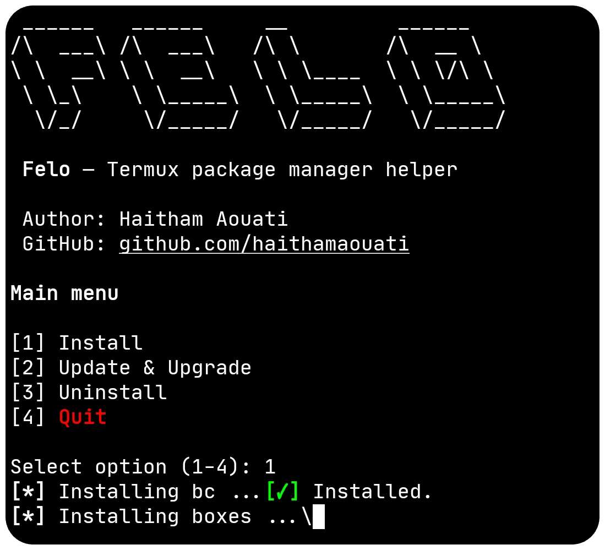

# Felo
**Felo** — a silent, menu-driven [Termux](https://termux.dev/en/) package manager with live spinners and zero noise.
Clean. Fast. In control.



## Installation

1. Clone the repository
```bash
git clone https://github.com/haithamaouati/Felo.git
```
2. Change to the Felo directory:
```
cd Felo
```
3. Run the script
```
bash felo.sh
```

##### Options:
1. Install
2. Update & Upgrade
3. Uninstall
4. Quite

## Environment
- Tested on [Termux](https://termux.dev/en/)

### Find this repository useful? ❤️
Support it by joining the [stargazers](https://github.com/haithamaouati/Felo/stargazers). ⭐

If you want to help even more, please spread the word — share the project on X, Reddit, or with your community so more people discover it.

And [follow me](https://github.com/haithamaouati) to keep up with future updates and projects. 🤩

## License

**Felo** is licensed under [WTFPL license](LICENSE)
